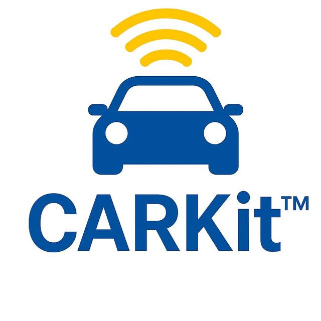

<div align="center">
  
  
  <a href="https://www.thecarlab.org/">The CAR Lab</a>
</div>

**CARKit** is a modular ROS 2 middleware platform for autonomous driving education, developed by the Connected and Autonomous Research (CAR) Lab at the University of Delaware for the Autonomous Driving Academy (ADA).

Designed around real autonomous vehicle workflows, CARKit provides a unified software stack for perception, navigation, planning, and control on small-scale Ackermann vehicles. The platform combines industry-standard ROS 2 tools with hands-on deployment on physical vehicles and simulation environments, enabling students to learn autonomous systems through practical experimentation.

## 🧩 Supported Platform

- 🚀 [NVIDIA Jetson Orin Nano](https://www.nvidia.com/en-us/autonomous-machines/embedded-systems/jetson-orin/nano-super-developer-kit/) with JetPack 6.x / L4T 36.x
- 🐳 Docker with [NVIDIA Container Toolkit](https://docs.nvidia.com/datacenter/cloud-native/container-toolkit/latest/install-guide.html)
- 📡 [SLAMTEC SLLiDAR/RPLIDAR](https://www.slamtec.com/en/support) publishing `/scan`
- 📷 [Intel RealSense](https://www.intel.com/content/www/us/en/architecture-and-technology/realsense-overview.html) color camera
- 🏎️ Ackermann/F1TENTH-style vehicle with [VESC](https://vesc-project.com/) odometry

ROS 2 and CARKit dependencies run inside `ariiees/carkit:latest`. The host
only needs JetPack, Docker, Git, display access for RViz, and device access.
Foxglove visualization is also available through Foxglove Bridge on port
`8765`.

## ⚙️ Setup

On the Jetson host:

```bash
git clone https://github.com/thecarlab/CARKit.git
cd CARKit
docker pull ariiees/carkit:latest
./docker/run_jetson.sh
```

Inside the container:

```bash
./docker/build_workspace.sh
source install/setup.bash
```

`build_workspace.sh` fetches vendored sensor repos and builds the mounted
workspace at `/workspaces/CARKit`.

### Foxglove account and connection

1. Register for a Foxglove account and sign in to Foxglove.
2. On the vehicle terminal, find the vehicle's IP address:

   ```bash
   hostname -I
   ```

3. In Foxglove, add a **Foxglove WebSocket** connection using
   `ws://<vehicle-ip>:8765`, replacing `<vehicle-ip>` with the address from the
   previous step.
4. Download [`docs/carkit_foxglove_layout.json`](docs/carkit_foxglove_layout.json)
   from this GitHub repository, then use Foxglove's **Import layout** option to
   add it to your account.

USB reminder before launching sensors:

- Connect the RealSense camera to a high-speed USB bus. If perception is
  unstable or images stop publishing, move the camera to a port that shows
  `10000M` or `5000M` in `lsusb -t`.
- Keep the lidar and VESC on separate stable USB connections when possible.
- Inside Docker, confirm devices are visible before launch:

```bash
lsusb -t
ls /dev/ttyUSB* /dev/ttyACM* 2>/dev/null
```

## 🕹️ Manual Driving And Mapping Control

For manual driving, mapping, and vehicle checks, launch human control directly:

```bash
ros2 launch carkit_human_control joystick.launch.py
```

This launches joystick teleop, VESC, odometry, and the legacy mux path from
`/teleop` to `/ackermann_cmd`.


Start human control as shown above, then launch mapping:

```bash
ros2 launch carkit_navigation navigation.launch.py \
  mode:=mapping visualization:=rviz
```

Drive through the environment, then save the occupancy map:

```bash
ros2 run nav2_map_server map_saver_cli \
  -f /workspaces/CARKit/map/test
```

Maps belong in the repository's top-level `map/` folder.

## 🤖 Autonomous Driving

Start human control with the legacy mux output remapped away from
`/ackermann_cmd`, start the control center, then launch Nav2:

```bash
ros2 launch carkit_human_control joystick.launch.py \
  vehicle_command_topic:=/ackermann_mux_unused
```

```bash
ros2 launch carkit_control_center control_center.launch.py
```

```bash
ros2 launch carkit_navigation navigation.launch.py \
  map:=/workspaces/CARKit/map/map.yaml \
  visualization:=foxglove
```

Connect Foxglove to `ws://<jetson-ip>:8765`, set the initial pose, then send a
Nav2 goal. Use `visualization:=rviz` instead when working directly in RViz.
Press the joystick mode toggle to enter `AUTO_DRIVE`; the current default is
`mode_toggle_button: 10` in
`f1tenth_stack/config/joy_teleop.yaml`.

The main map is selected above. To use the 3F example map instead, pass:

```bash
map:=/workspaces/CARKit/map/map_3f.yaml
```

### 👁️ Perception And Behavior

Start the color-only RealSense driver and typed 2D YOLO perception:

```bash
ros2 launch carkit_perception perception.launch.py
```

Perception visualization is off by default. Add `visualization:=rviz` or
`visualization:=foxglove` when you want a local RViz window or Foxglove Bridge.

Start behavior overrides separately:

```bash
ros2 launch carkit_behavior behavior_center.launch.py
```

Behavior logic only affects commands while the control center is in
`AUTO_DRIVE`.

## 🗂️ Repository Layout

```text
carkit/
  control/       human teleop, behavior layer, autonomous command arbiter
  navigation/    SLAM Toolbox, AMCL, Nav2, Twist-to-Ackermann bridge
  perception/    color-only YOLO and typed 2D detection messages
  sensors/       sensor driver fetch notes and transform nodes
  vehicle/       vendored F1TENTH/VESC vehicle stack
  tools/         classroom utilities and demos
map/             all occupancy maps
docker/          image, run, build, and publish scripts
docs/            troubleshooting and diagrams
```

## 📚 More Docs

- [Control](carkit/control/README.md)
- [Navigation](carkit/navigation/README.md)
- [Perception](carkit/perception/README.md)
- [Sensors](carkit/sensors/README.md)
- [Vehicle](carkit/vehicle/README.md)
- [Docker](docker/README.md)
- [Troubleshooting](docs/troubleshooting.md)
