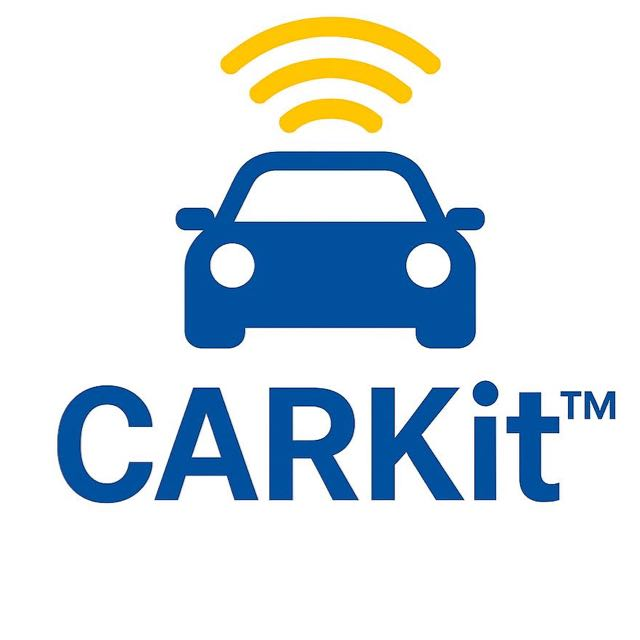

<div align="center">
  
  
  <a href="https://www.thecarlab.org/">The CAR Lab</a>
</div>

**CARKit** is a modular ROS 2 middleware platform for autonomous driving education, developed by the Connected and Autonomous Research (CAR) Lab at the University of Delaware for the Autonomous Driving Academy (ADA).

Designed around real autonomous vehicle workflows, CARKit provides a unified software stack for perception, navigation, planning, and control on small-scale Ackermann vehicles. The platform combines industry-standard ROS 2 tools with hands-on deployment on physical vehicles and simulation environments, enabling students to learn autonomous systems through practical experimentation.

## 🧩 Supported Platforms

- 🚀 [NVIDIA Jetson Orin Nano](https://www.nvidia.com/en-us/autonomous-machines/embedded-systems/jetson-orin/nano-super-developer-kit/) with JetPack 6.x / L4T 36.x
- 🐳 Docker with [NVIDIA Container Toolkit](https://docs.nvidia.com/datacenter/cloud-native/container-toolkit/latest/install-guide.html)
- 🏎️ OSRacer chassis, LakiBeam lidar, and UVC camera
- 🏎️ F1TENTH/VESC chassis with URG lidar and RealSense camera

ROS 2 and CARKit dependencies run inside `ariiees/carkit:latest`. The host
only needs JetPack, Docker, Git, and the CARKit device rules. ROS 2 Desktop,
RViz, and rqt remain available inside the image for debugging, but no ROS GUI
is started automatically. The normal interface is the lightweight CARKit
WebUI on port `8080`. It draws the map, path, lidar, camera/perception results,
and Jetson/chassis telemetry through the native C++ CARKit WebSocket bridge.

## ⚙️ Setup

On the Jetson host:

```bash
git clone --branch ada2026 https://github.com/thecarlab/CARKit.git ~/CARKit
cd ~/CARKit
docker pull ariiees/carkit:latest
./docker/setup_osracer_device.sh
./docker/run_jetson.sh
```

Open `http://<jetson-ip>:8080`, select **OSRacer** or **F1TENTH**, and click
**Install / build selected chassis**. The installer builds only that hardware
adapter. The dashboard then lets you choose the course profile, independently
override each algorithm, select startup components, launch, stop, and inspect
live results. The collaborative **Code editor** exposes only the selected
course package, provides a file explorer and syntax diagnostics, and supports
up to five users editing together. The **Compile** page can rebuild the entire
repository or only perception, localization, control, or planning. The next
launch automatically sources the updated install overlay.

### Start automatically at boot

To make the WebUI/container start whenever the Jetson boots, install the
included systemd unit once:

```bash
sudo install -m 0644 docker/carkit.service /etc/systemd/system/carkit.service
sudo systemctl daemon-reload
sudo systemctl enable --now carkit.service
```

The service starts after Docker and does not require a GNOME login. It runs
the equivalent of `cd ~/CARKit && ./docker/run_jetson.sh`. Useful commands:

```bash
systemctl status carkit
sudo systemctl restart carkit
sudo systemctl stop carkit
journalctl -u carkit -f
```

To use a shell instead of the WebUI:

```bash
./docker/run_jetson.sh bash
./docker/install_carkit.sh osracer   # or: f1tenth
```

`install_carkit.sh` records the selected chassis in `.carkit/config.json`,
fetches the pinned optional F1TENTH source when needed, and builds the mounted
workspace at `/workspaces/CARKit`.

## 🎓 Course Profiles

- `reference`: native C++ planning, behavior, localization adapters, and
  control; Python is retained only for YOLO/TensorRT perception.
- `ada_high_school`: working guided planning, control, and perception from the
  student-owned `carkit_ada_academy` package.
- `intro2av`: safe ROS 2 boilerplates for planning, control, and perception in
  both Python and C++; topic names, timers, and the safety boundary remain.

Behavior planning remains enabled for every profile and lives in the planning
layer. Course selection changes planning, control, and perception ownership
together; each ownership selector can still override one component without
modifying the reference source.

Switching a component in the WebUI never copies over the reference source.
Student work lives in the separate `carkit/education/carkit_ada_academy` and
`carkit/education/carkit_intro2av` and `carkit_intro2av_cpp` packages;
reference implementations stay in their production packages. Changing the
course selector chooses Intro2AV Python initially, while each Algorithm
Ownership selector can independently switch to Intro2AV C++. See
[`docs/course_profiles.md`](docs/course_profiles.md).

### WebUI connection

1. On the vehicle terminal, find the vehicle's IP address:

   ```bash
   hostname -I
   ```

2. Open `http://<vehicle-ip>:8080` from any browser on the same network. The
   Overview provides the map, LiDAR, perception overlay, launch controls,
   telemetry, and goal/pose tools without an RViz or Foxglove process.

To localize the vehicle, click **Set initial pose**, press on its current map
position, drag toward the vehicle's forward direction, and release. Goal poses
use the same position-and-heading gesture. Drag the map to rotate, Shift-drag
to pan, and use the mouse wheel to zoom.

USB reminder before launching sensors:

- Connect the OSRacer USB hub and verify the UVC camera alias. The LakiBeam is
  exposed over USB Ethernet at `192.168.8.2`.
- Inside Docker, confirm devices are visible before launch:

```bash
lsusb -t
ls -l /dev/osrbot_base /dev/osrbot_usb_cam
ping -c 1 192.168.8.2
```

## 🕹️ Manual Driving And Mapping Control

For manual driving, mapping, and vehicle checks, launch human control directly:

```bash
ros2 launch carkit_human_control joystick.launch.py
```

In another terminal, start the OSRacer camera and lidar:

```bash
ros2 launch osracer_bringup sensors_launch.py
```

This launches joystick teleop, the OSRacer chassis driver, odometry, and the
manual command relay from `/teleop` to `/ackermann_cmd`.


Start human control as shown above, then launch mapping:

```bash
ros2 launch carkit_navigation navigation.launch.py \
  mode:=mapping start_lidar:=false
```

Drive through the environment, then save the occupancy map:

```bash
ros2 run nav2_map_server map_saver_cli \
  -f /workspaces/CARKit/map/test
```

Maps belong in the repository's top-level `map/` folder.

## 🤖 Autonomous Driving

Start human control with the manual OSRacer relay remapped away from
`/ackermann_cmd`, start the control center, then launch Nav2:

```bash
ros2 launch carkit_human_control joystick.launch.py \
  vehicle_command_topic:=/manual_command_unused
```

```bash
ros2 launch carkit_control_center control_center.launch.py
```

```bash
ros2 launch carkit_navigation navigation.launch.py \
  map:=/workspaces/CARKit/map/map_5fs.yaml \
  start_lidar:=false
```

Open the WebUI, set the initial pose, and send a Nav2 goal from the Overview.
Press the joystick mode toggle to enter `AUTO_DRIVE`; the current default is
`mode_toggle_button: 10` in
`osracer_bringup/config/joy_teleop.yaml`.

The reference Nav2 controller currently targets a `2.0 m/s` cruise speed. It
can reduce to `0.8 m/s` while approaching a goal, following tight curvature,
or applying the cone behavior override; the command pipeline is capped at
`3.0 m/s`.

The main map is selected above. To use the 3F example map instead, pass:

```bash
map:=/workspaces/CARKit/map/map_3f.yaml
```

### 👁️ Perception And Behavior

With the selected sensor bringup publishing the camera, start typed 2D YOLO
perception:

```bash
ros2 launch carkit_perception perception.launch.py
```

The WebUI shows the annotated perception stream directly. Its
configuration drawer can select generic COCO, traffic-sign-only, combined, or
a custom Jetson TensorRT model. In the map/lidar panel, drag to rotate,
Shift-drag to pan, use the mouse wheel to zoom, and double-click to reset.

Start behavior overrides separately:

```bash
ros2 launch carkit_behavior behavior_center.launch.py
```

Behavior logic only affects commands while the control center is in
`AUTO_DRIVE`.

## 🗂️ Repository Layout

```text
carkit/
  core/          one carkit_bringup entry point, profiles, stable interfaces
  education/     separate ADA Academy and Intro2AV algorithm packages
  interface/     WebUI, collaborative editor, and native C++ ROS bridge
  control/       human teleop and autonomous command safety arbiter
  planning/      scalable road-behavior planning rules
  navigation/    SLAM Toolbox, AMCL, Nav2, Twist-to-Ackermann bridge
  perception/    color-only YOLO and typed 2D detection messages
  sensors/       camera, scan filter, sensor transforms, and vendor adapters
  vehicle/       OSRacer integration and pinned F1TENTH vendor selection
  tools/         classroom utilities and demos
map/             all occupancy maps
docker/          image, run, build, and publish scripts
docs/            troubleshooting and diagrams
```

All supported workflows start through one ROS entry point inside the one
`carkit` Docker container:

```bash
ros2 launch carkit_bringup carkit.launch.py \
  profile:=intro2av chassis:=f1tenth
```

Vendor package names such as `osracer_base`, `f1tenth_stack`, and `vesc_driver`
remain unchanged so upstream updates and licenses stay traceable. They are
isolated behind the CARKit launch and topic contract.

## 📚 More Docs

- [Control](carkit/control/README.md)
- [Navigation](carkit/navigation/README.md)
- [Perception](carkit/perception/README.md)
- [Sensors](carkit/sensors/README.md)
- [Vehicle](carkit/vehicle/README.md)
- [Docker](docker/README.md)
- [Troubleshooting](docs/troubleshooting.md)
- [Architecture and course profiles](docs/course_profiles.md)
- [WebUI design](docs/webui_design.md)
